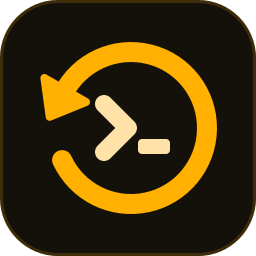

<p align="center">
  
</p>

<h1 align="center">retroagent</h1>

<p align="center">
  <b>Your agents forget. retroagent remembers.</b><br>
  It keeps every Claude Code and Codex session from every machine in a private Git repo that you own.
  One command searches them all.
</p>

<p align="center">
  <a href="LICENSE"></a>
  
  
  <a href="docs/installation.mdx"></a>
  <a href="docs/installation.mdx#by-hand-or-for-codex-only"></a>
  
  <a href="https://github.com/gabe4coding/retroagent/commits/main"></a>
  <a href="https://github.com/gabe4coding/retroagent/stargazers"></a>
</p>

<p align="center">
  <a href="#quick-start">Quick start</a> ·
  <a href="docs/commands.mdx">Commands</a> ·
  <a href="docs/sync.mdx">How it works</a> ·
  <a href="docs/pages-routine.mdx">Pages &amp; retros</a> ·
  <a href="docs/configuration.mdx">Config</a>
</p>

---

- **Sync**: the sync writes each session as a short Markdown file in your data repo. It redacts secrets, and gitleaks
  scans every commit that the sync makes.
- **Search**: `kb find "how did I fix the flaky test"` searches a local SQLite index at a very low token cost. Skills
  tell Claude Code and Codex to search there first. Optional [semantic search](docs/commands.mdx#semantic-search) uses
  a local model to also find paraphrases and other languages. It works in cloud sessions too. retroagent also
  collects Claude Code [cloud sessions](docs/commands.mdx#capture-cloud-sessions).
- **Pages and retros** *(optional)*: the pages routine runs in the cloud. It keeps one project page for each project
  and one retro for each week. Each bullet links to its source session.

retroagent uses two repos. This public repo holds the code and no data. Your private **data repo** holds the data,
and you own it.

https://github.com/user-attachments/assets/9d586f2c-7839-443a-b75b-120dd6eeacd0

<p align="center"><sub>A 4.5-minute video explains retroagent: the sync, the two repos, cloud sessions, search
with <code>kb</code> by words or by meaning, project pages, hints when a command fails, and weekly retros. The retros
propose changes to the environment of your agent.</sub></p>

## Quick start

You need these tools:

- git
- Python 3.9+
- [gitleaks](https://github.com/gitleaks/gitleaks) (`brew install gitleaks`)
- the GitHub CLI `gh`

### Let your agent do it

Paste this prompt into Claude Code or Codex:

```text
Set up retroagent on this machine for me: https://github.com/gabe4coding/retroagent
1. If ~/.retroagent does not exist, clone the repo there.
2. Read ~/.retroagent/skills/setup/SKILL.md and follow it step by step. Use ~/.retroagent/bin/kb while `kb` is
   not on my PATH yet.
3. Ask me one question at a time, and show me each command before it creates a repo, pushes or changes anything
   outside this machine. My data repo must be private.
4. install.sh also installs the Claude Code and Codex plugins: tell me if it prints a WARNING, and at the end
   remind me to start a new session (and, in Codex, to trust the retroagent hook with /hooks).
5. Never ask me for a token or a secret: I type those in my own terminal.
```

The agent asks you before each step. It does these steps:

1. It creates or picks your private data repo.
2. It installs the plugins and the `kb` CLI.
3. It runs the first sync.
4. It enables automatic syncs.

### Or with the Claude Code plugin

```
/plugin marketplace add gabe4coding/retroagent
/plugin install retroagent@retroagent
/retroagent:setup
```

To install by hand, read [Installation](docs/installation.mdx).

## Use it

```bash
kb find flaky test timeout     # ranked pages, memories and sessions
kb summary 9a1be7d2            # decisions, outcome, files and PRs of one session
kb show 9a1be7d2 --grep error  # only the part you need
kb stats                       # how you use your agents
```

You can also ask your agent: *"how did I fix this last time?"* or *"retro of last week"*.

## Documentation

| Page | |
| --- | --- |
| [Installation](docs/installation.mdx) | Requirements, plugin and manual install, host names, updates |
| [Commands](docs/commands.mdx) | Every `kb` command |
| [How the sync works](docs/sync.mdx) | What the sync writes and when, and the one-writer-per-host rule |
| [Pages routine](docs/pages-routine.mdx) | The optional cloud routine for project pages and weekly retros |
| [Configuration](docs/configuration.mdx) | Every key of `config.json` |
| [Troubleshooting](docs/troubleshooting.mdx) | `kb repair` and common errors |
| [Development](docs/development.mdx) | Layout, tests, releases |

## License

MIT. See [LICENSE](LICENSE).
